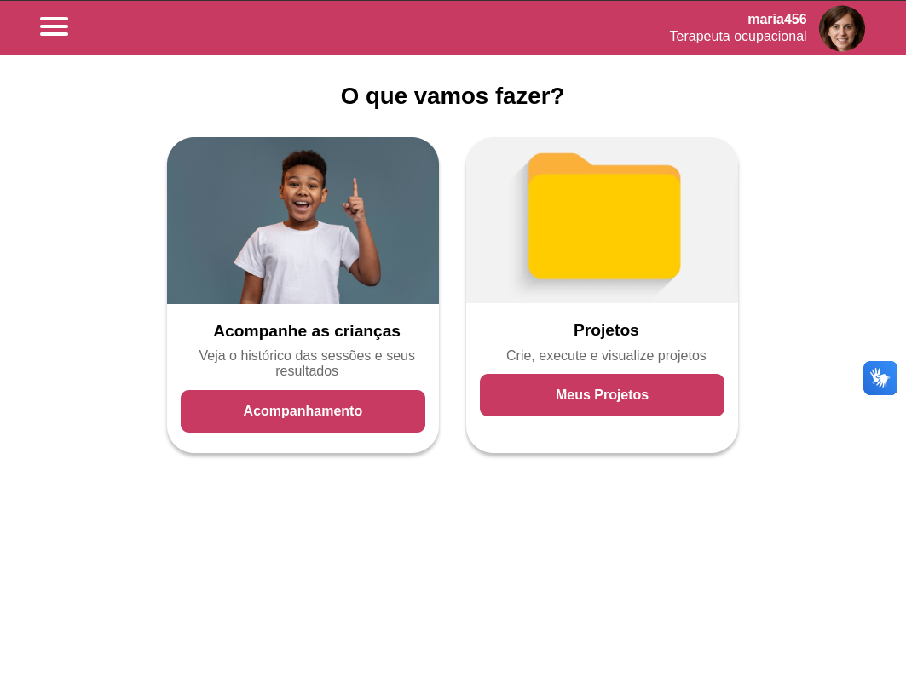

# Ambiente de Desenvolvimento Integrado (IDE)


O Ambiente de Desenvolvimento Integrado (IDE) é uma parte central do nosso projeto, projetado para facilitar a criação de projetos e mini jogos para Terapia Ocupacional.

## Estrutura de pastas
```
IDE/
├── public/ # Arquivos estáticos e scripts
│ ├── db/ # Arquivos de banco de dados
│ │ └── database.sqlite # Banco de dados SQLite
│ ├── py/ # Scripts Python
│ │ └── app.py # Script de aplicativo Python
│ └── [várias imagens e arquivos SVG]
├── source/ # Código-fonte principal
│ ├── assets/ # Arquivos como imagens e estilos
│ │ ├── img/ # Arquivos de imagem
│ │ └── styles/ # Arquivos CSS (estilo)
│ ├── components/ # Componentes React
│ │ ├──...(componentes)
│ ├── contexts/ # Contextos React
│ ├── pages/ # Páginas da IDE
│ │ ├── Game/ # Página de controle de cenas
│ │ ├── Home/ # Página Inicial
│ │ ├── Login/ # Página de Login
│ │ ├── Patients/ # Página de Pacientes
│ │ ├── Projects/ # Página de Projetos
│ │ └── Editor/ # Página de Editor de blocos
│ └── routes/ # Controle de Rotas da aplicação
├── src/ # Scripts do Electron
├── index.html # Arquivo HTML de entrada
└── package.json # Metadados e dependências do projeto


```


## Tecnologias usadas
### Frontend
- React.js
- Vite
- TypeScript
- CSS
- Electron (para suporte a aplicativos desktop)

### Backend
- Python
- FastAPI
- Uvicorn

## Instalação
1. Clone o repositório `git clone https://github.com/2023M8T1Inteli/grupo2`

### 1. Frontend
1. `cd src/IDE`
2. Instale as dependências: `yarn install` or `npm install`
3. Inicie o servidor de desenvolvimento: `yarn start` or `npm start` (Por favor, certifique-se de que o backend Python esteja em execução antes de iniciar a aplicação)
4. Para build final do projeto (em desenvolvimento): `yarn build` or `npm build`

### 2. Backend
1. `cd ../src`
2. Certifique-se de que o Python3.5+, [Uvicorn, and FastAPI estão instalados no seu sistema](https://fastapi.tiangolo.com/tutorial/)
3. Inicie o servidor "bridge": `uvicorn bridge:app --reload`
   - Isso inicia a aplicação backend em Python